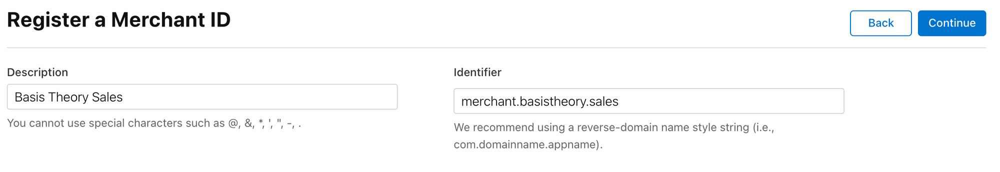

# Create Merchant ID

After the enrollment is complete, developers can create Merchant IDs in [Apple's portal](https://developer.apple.com/account/resources/identifiers/add/merchant).
Requirements are minimal:

The identifier **can't** be changed later.

Existing Merchant IDs can be found [here](https://developer.apple.com/account/resources/identifiers/list/merchant).
