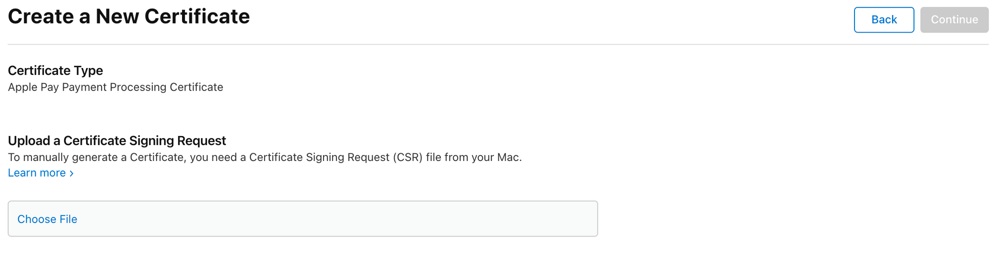

# Create Merchant Identity Certificate

Find your Merchant ID in the [Merchant List](https://developer.apple.com/account/resources/identifiers/list/merchant) and navigate to its detail page.

In the **Apple Pay Merchant Identity Certificate** section, click _Create Certificate_ to be directed to the Certificate Signing Request (CSR) upload page.



To create a new CSR, we will use [OpenSSL](https://www.openssl.org/).

First we must create a new private key:

```bash
openssl genrsa -out merchant_id_private.key 2048
```

Then, source the private key to create a new CSR:

```bash
openssl req -new -key merchant_id_private.key -out merchant_id.csr -subj '/O=Company/C=US'
```

> 💡 Update the `subj` param to match your company information. For example:
>
> ```text
> -subj "/CN=EnchantedWidgets, Inc./O=EnchantedWidgets, Inc./OU=Product Development/CN=John Doe/UID=johndoe/EMAIL=johndoe@example.com/STREET=123 Fantasy Lane/L=Fairyville/ST=Fairyland/C=FL/POSTALCODE=12345/DC=fantasy/DC=local"
> ```

Upload the `merchant_id.csr` file in Apple portal to create a new Certificate.

Download the `merchant_id.cer` file and convert it to PEM format, for later usage:

```bash
openssl x509 -inform der -in merchant_id.cer -out merchant_id.pem
```

> ⚠️ These files are sensitive and should be stored somewhere safe.
