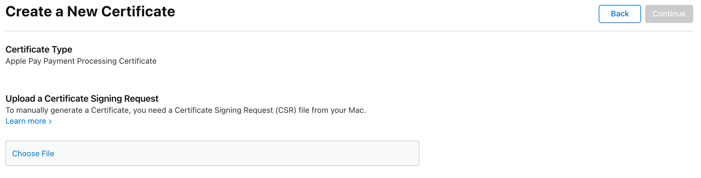

# Create Payment Processing Certificate

Find your Merchant ID in the [Merchant List](https://developer.apple.com/account/resources/identifiers/list/merchant) and navigate to its detail page.

In the **Apple Pay Payment Processing Certificate** section, click _Create Certificate_ to be directed to the Certificate Signing Request (CSR) upload page.



To create a new CSR, we will use [OpenSSL](https://www.openssl.org/).

First we must create a new private key:

```bash
openssl ecparam -out apple_pay_private.key -name prime256v1 -genkey
```

> 💡 Notice how we use `ecparam` to instruct creating a EC (elliptic curve) key. This is because ECC is used for all regions besides China, which uses RSA.

Then, source the private key to create a new CSR:

```bash
openssl req -newkey rsa:2048 -new -sha256 -key apple_pay_private.key -nodes -nodes -out apple_pay.csr -subj '/O=Company/C=US'
```

> 💡 Update the `subj` param to match your company information. For example:
>
> ```text
> -subj "/CN=EnchantedWidgets, Inc./O=EnchantedWidgets, Inc./OU=Product Development/CN=John Doe/UID=johndoe/EMAIL=johndoe@example.com/STREET=123 Fantasy Lane/L=Fairyville/ST=Fairyland/C=FL/POSTALCODE=12345/DC=fantasy/DC=local"
> ```

Upload the `apple_pay.csr` file in Apple portal to create a new Certificate.

Download the `apple_pay.cer` file and convert it to PEM format, for later usage:

```bash
openssl x509 -inform der -in apple_pay.cer -out apple_pay.pem
```

> ⚠️ These files are sensitive and should be stored somewhere safe.
